# Getting Started with OPK and an Adafruit soil moisture sensor via wireless (with Moteinos)

## Sensor + Network Topology

[soil moisture probe] --> [Moteino + battery + radio] -----------> [Moteino + radio] --> [Rpi + wifi]

## Required Hardware

- Raspberry Pi (link to sources)
- Wifi dongle (link to sources)
- SD card (link to sources)
- Adafruit soil moisture sensor [LINK]
- 2 (two) Moteinos [LINK]
- Lipo battery (Adafruit -- LINK)
- Lipo battery charger
- FTDI programming cable [LINK]

## Background

### Use-cases

This setup can be used to monitor soil moisture in a field or a greenhouse.  Several wireless soil moisture probes can be used to 'talk' to a single Raspberry Pi, which can be located centrally (inside a barn or house, say).

### Rationale

In this setup we'll be using a soil moisture probe from Adafruit connected to a Moteino. Moteinos are programmable just like Arduino UNOs (though they require an additional FTDI cable), but they include an RFM69 radio.  

The Moteino monitors the soil moisture probe, then sends the measurements (temperature and moisture) over the radio link to another Moteino, which is connected directly to a Raspberry Pi.

In this way, the Raspberry Pi can be located inside, many meters away from the soil moisture measurement.  This may have several advantages, including:

- **Reliability**.  The Moteino + radio is a simpler system than the Raspberry Pi, and may be more reliable in the long term.  This way, the more complex hardware is kept centralized and better-protected (inside a barn): you only need to check on one Raspberry Pi, which can be monitoring several Moteinos.

- **Radio range**.  The RFM69 is a ~900 MHz radio antenna, which typically will allow for better performance at longer-range, through tree cover, and in rainy conditions than does wifi (which is at 2.4 GHz -- the same range as microwave ovens, and thus particularly likely to be absorbed by water).  

## [Soil Moisture Probe] --> [Moteino + battery + radio]

The soil probe we'll be using is the one provided by Adafruit, here:

https://www.adafruit.com/products/1298

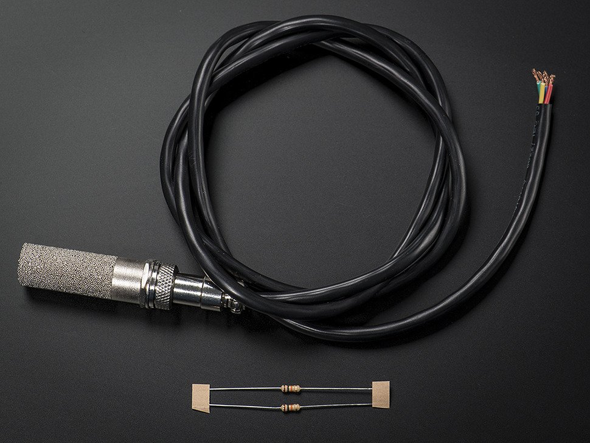

### Programming the Moteino

- You'll want to download the humidity probe library, here:

https://github.com/practicalarduino/SHT1x

- As well as the Moteino radio library, here:

https://github.com/LowPowerLab/RFM69

- And then you'll want to upload the firmware we've put together for the soil moisture wireless node, here:

https://github.com/openpipekit/tuckaway-soil-moisture/tree/master/tuckawaySoilMoistureRecord

### Connecting the Moteino to the soil moisture probe

Adafruit provides details on hooking up the sensor to an Arduino, and we'll be following the same instructions for connecting to a Moteino:

> The sensor is essentially just a Sensiron SHT-10 with the 4 data/power wires brought out so any SHT-1X code for a microcontroller will work. The sensor works with 3 or 5V logic. The 1 meter long cable has four wires: Red = VCC (3-5VDC), Black or Green = Ground, Yellow = Clock, Blue = Data. For Arduino, there's a handy Sensiron library with example. For Propeller, there's an SHT1X sensor object. Don't forget to connect a 10K resistor from the blue Data line to VCC.

The connection will end up looking something like this:

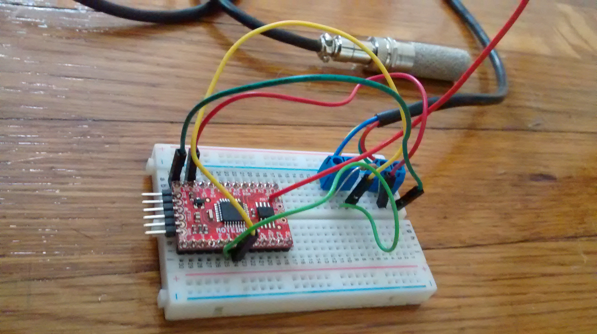

You'll want to add a 3.7V battery, such as the one provided by Adafruit:

https://www.adafruit.com/product/258

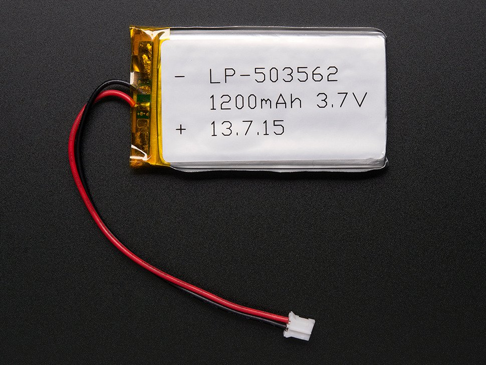

You'll also want to add a lipo charger to the circuit -- both to recharge the battery, and as a nice way of connecting to the Moteino:

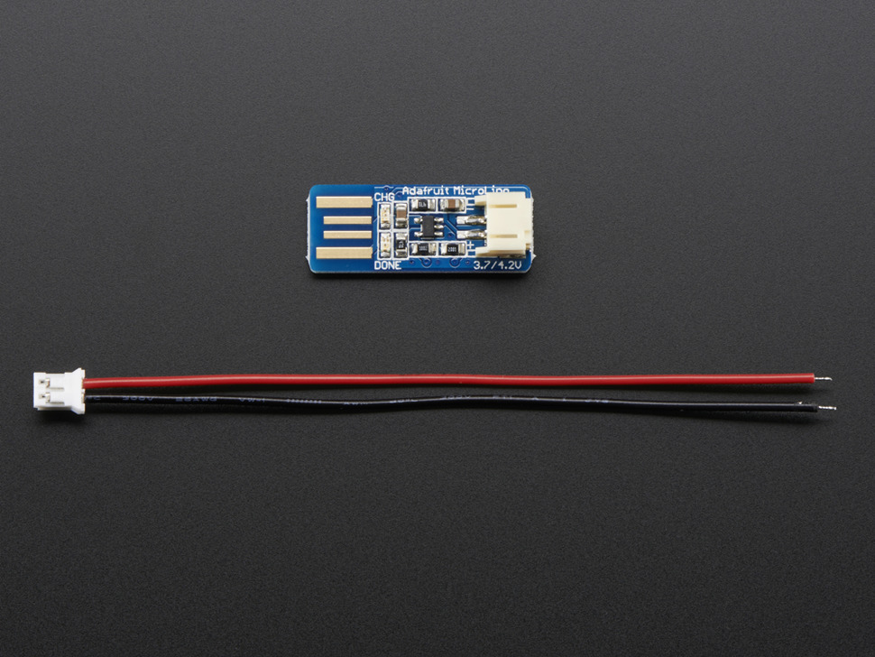

Adafruit sells them here:  https://www.adafruit.com/product/1304


## [Moteino + radio] --> [RPi]

Here, you'll be using the same Arduino libraries as above for the Moteino in this setup, but the custom firmware for acting as a radio 'gateway' is here:

https://github.com/openpipekit/tuckaway-soil-moisture/tree/master/tuckawayRadioReceive

You'll then plug the Moteino + an FTDI cable directly into the Raspberry Pi USB port.

### [RPi] -- wifi dongle

Add the wifi dongle (such as the one provided by Adafruit, here: https://www.adafruit.com/product/1030)

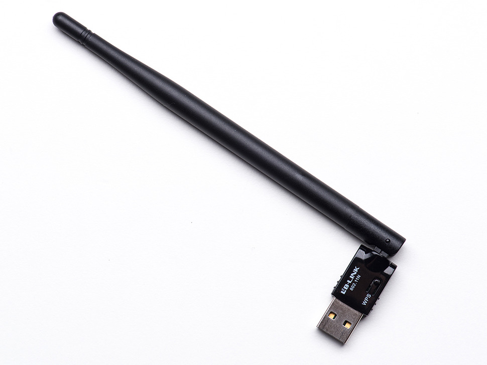

Plug this wifi dongle directly into a Raspberry Pi USB port.

In the end, you'll have something like this on the RPi end of things:

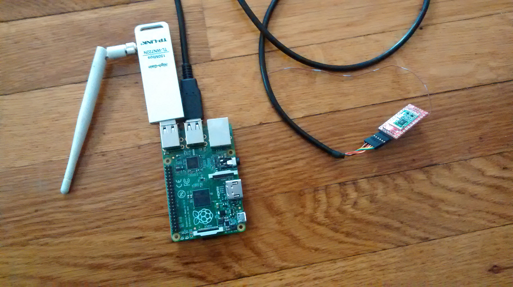


## Preparing an SD card

First, download the latest OPK SD card image here:

Then, follow your favorite procedure for 'burning' the image to an SD card:  
- Adafruit tutorial for Windows: https://learn.adafruit.com/adafruit-raspberry-pi-lesson-1-preparing-and-sd-card-for-your-raspberry-pi/making-an-sd-card-using-a-windows-vista-slash-7
- Adafruit tutorial for Mac: https://learn.adafruit.com/adafruit-raspberry-pi-lesson-1-preparing-and-sd-card-for-your-raspberry-pi/making-an-sd-card-using-a-mac
- Raspberry Pi tutorial
- Linux command line:

```
sudo -i
df -h
umount /dev/X
// where X is /mmcblk.. or /sdX
zcat 20150512-pirateship.img.gz > /dev/mmcblk0
// or whatever above //volume was
```

## Programming  

In order to transmit

## Setting up the remote database (phant)

Navigate to: https://data.sparkfun.com/streams/make

You'll see a page like this:

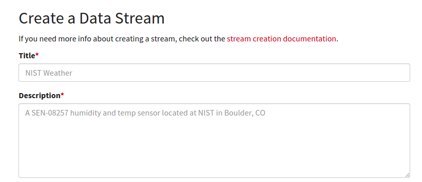

Fill in all the required information.  

In particular, you will need to name the 'fields' you're interested -- i.e., the parameters you're interested in measuring.  For this tutorial, you should name only one field, and call it 'temp', like this:

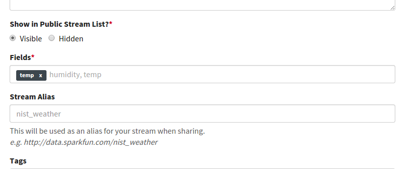

When you're done, you'll be shown a page with information about your stream:

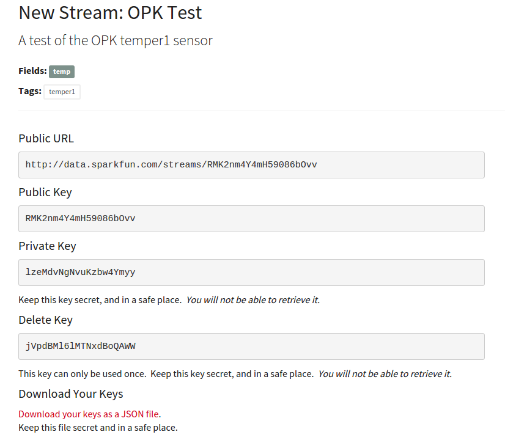

Make note of the public and private keys; but also download the 'keys' file locally to your computer by clicking on 'Download your keys as a JSON file'.

NOTE: open up the 'Public URL' listed on this page in a separate browser tab -- you'll be checking on this later.

## Preparing your 'sensor recipe' (autorun.sh)

For this tutorial, we'll be using a pre-existing recipe, located here: https://gist.github.com/dwblair/953711269a00664bbdf0

Click on the 'raw' button and copy the text into a file on your home computer that you rename 'autorun.sh':

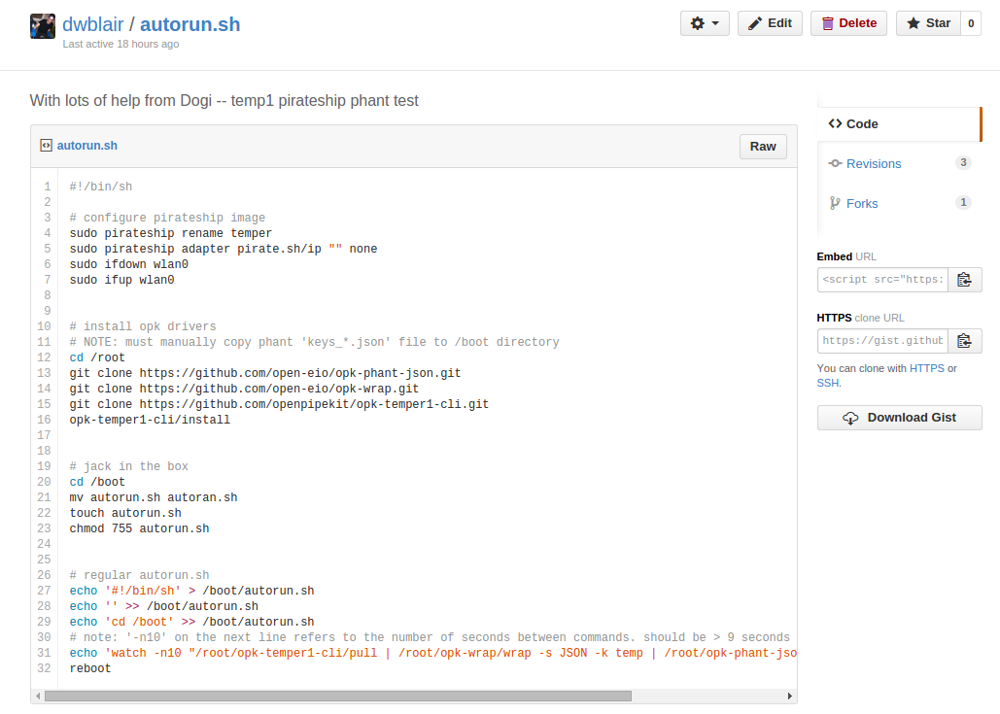

## Finalizing the SD card

Mount your SD card, and navigate to the 'boot' partition.

- Copy 'autorun.sh' to the directory '/boot'.
- Copy your 'keys' file to the directory '/boot'.

## Run it!

Now, with the Raspberry Pi off,

- plug the SD card into the Raspberry Pi;
- connect a temper1 sensor into a USB port;

Now, power up the Raspberry Pi!

Note: will take up to several minutes for the initialization process to complete (it will take less long on subsequent boots).

When the initialization process is over, the wifi dongle should be flashing consistently.  

When you believe the initialization procedure has finished, navigate to the 'Public URL' for the stream you've created.  You should see sensor values start to appear every 10 seconds or so.

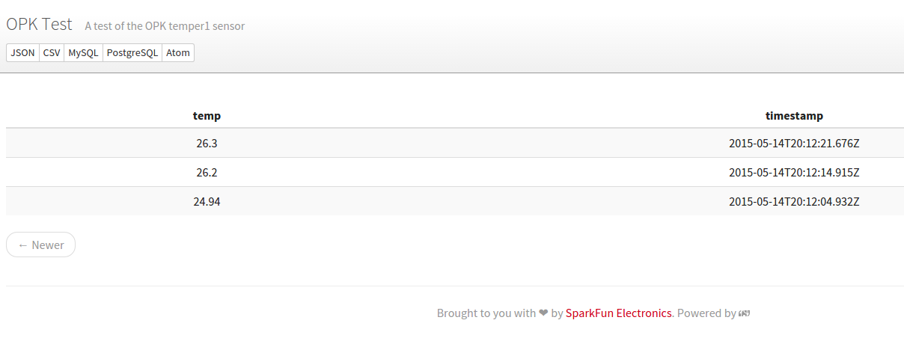
