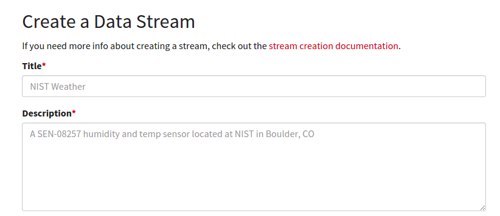
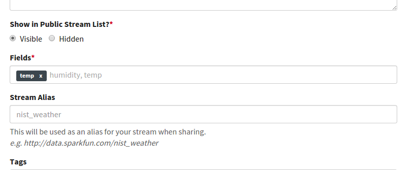
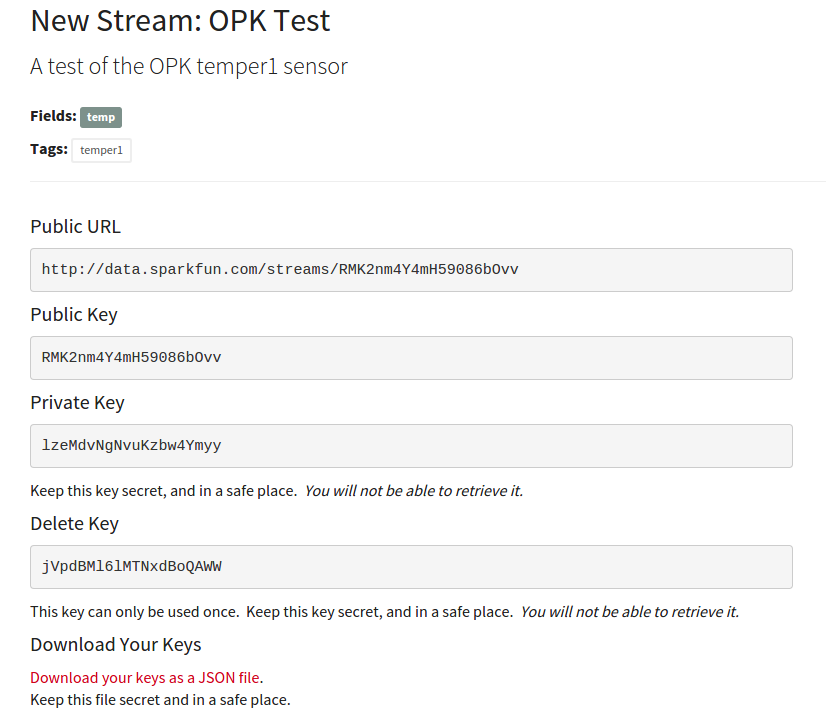
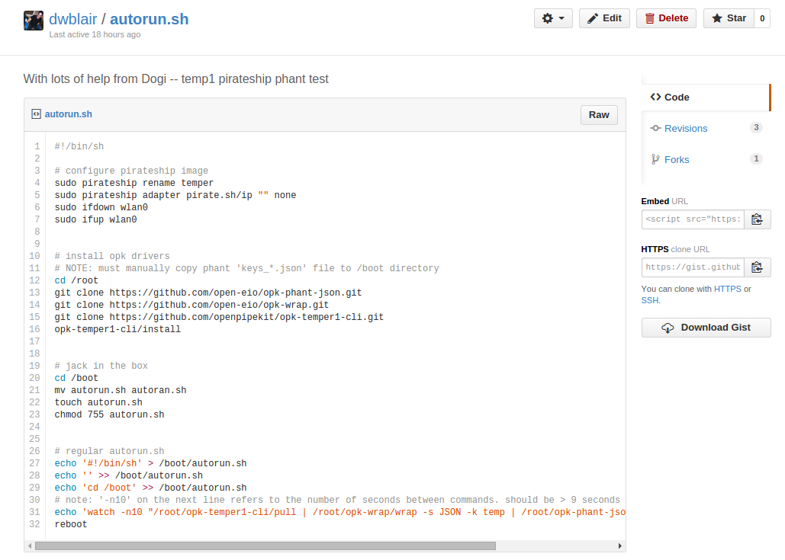
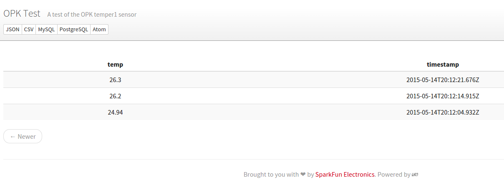

# Getting Started with OPK and a temper1 sensor on a Raspberry Pi

## Required Hardware

- Raspberry Pi (link to sources)
- Wifi dongle (link to sources)
- SD card (link to sources)
- Temper1 (no longer available for purchase)

## Preparing an SD card

First, download the latest OPK SD card image here: http://pirate.sh/latest-pirateship.img.gz
unzip it if necessary

Then, follow your favorite procedure for 'burning' the image to an SD card:  
- Adafruit tutorial for Windows: https://learn.adafruit.com/adafruit-raspberry-pi-lesson-1-preparing-and-sd-card-for-your-raspberry-pi/making-an-sd-card-using-a-windows-vista-slash-7
- Adafruit tutorial for Mac: https://learn.adafruit.com/adafruit-raspberry-pi-lesson-1-preparing-and-sd-card-for-your-raspberry-pi/making-an-sd-card-using-a-mac
- Raspberry Pi tutorial
- Linux command line:

```
sudo -i
df -h
umount /dev/X
// where X is /mmcblk.. or /sdX
zcat 20150512-pirateship.img.gz > /dev/mmcblk0
// or whatever above //volume was
```

## Setting up the remote database (phant)

Navigate to: https://data.sparkfun.com/streams/make

You'll see a page like this:



Fill in all the required information.  

In particular, you will need to name the 'fields' you're interested -- i.e., the parameters you're interested in measuring.  For this tutorial, you should name only one field, and call it 'temp', like this:



When you're done, you'll be shown a page with information about your stream:



Make note of the public and private keys; but also download the 'keys' file locally to your computer by clicking on 'Download your keys as a JSON file'.

NOTE: open up the 'Public URL' listed on this page in a separate browser tab -- you'll be checking on this later.

## Preparing your 'sensor recipe' (autorun.sh)

For this tutorial, we'll be using a pre-existing recipe, located here: https://gist.github.com/dwblair/953711269a00664bbdf0

Click on the 'raw' button and copy the text into a file on your home computer that you rename 'autorun.sh':



## Finalizing the SD card

Mount your SD card, and navigate to the 'boot' partition.

- Copy 'autorun.sh' to the directory '/boot'.
- Copy your 'keys' file to the directory '/boot'.

## Run it!

Now, with the Raspberry Pi off,

- plug the SD card into the Raspberry Pi;
- plug a wifi dongle into USB;
- connect a temper1 sensor into a USB port;

Now, power up the Raspberry Pi!

Note: will take up to several minutes for the initialization process to complete (it will take less long on subsequent boots).

When the initialization process is over, the wifi dongle should be flashing consistently.  

When you believe the initialization procedure has finished, navigate to the 'Public URL' for the stream you've created.  You should see sensor values start to appear every 10 seconds or so.


